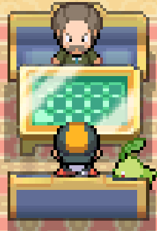
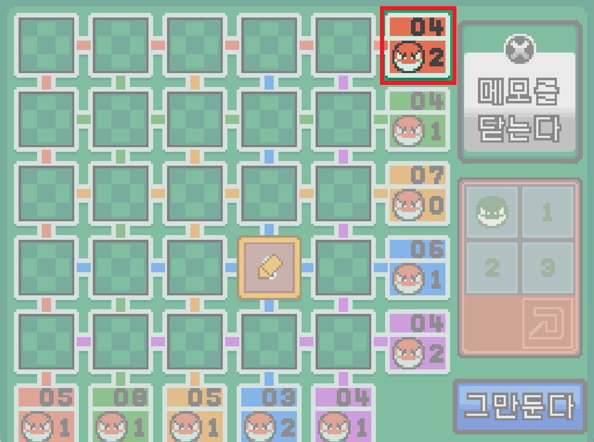
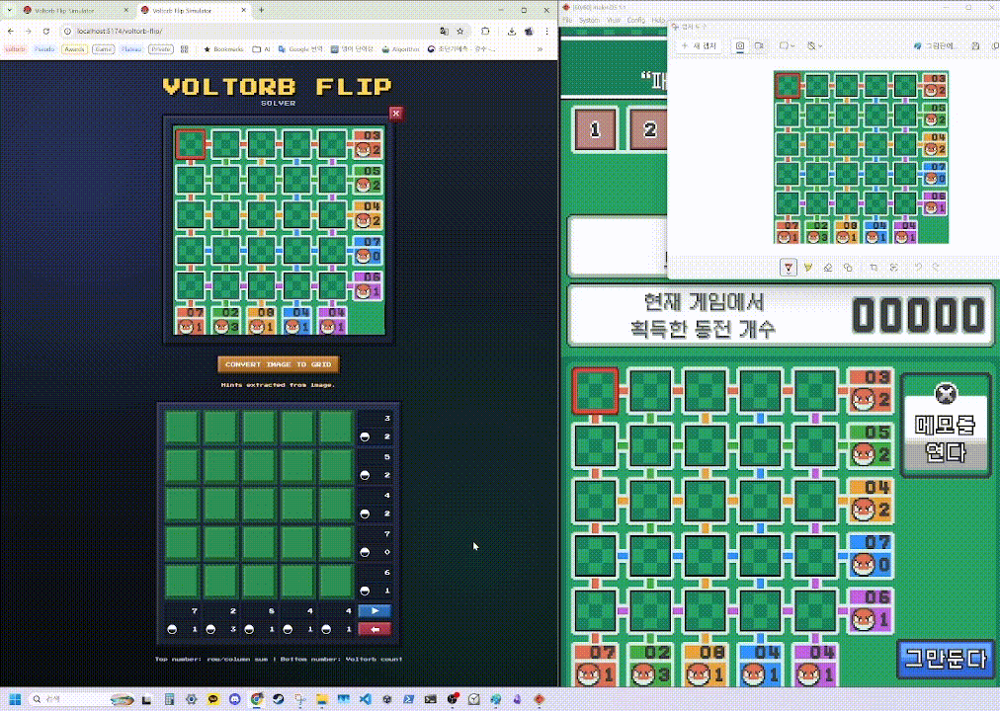

# Voltorb Flip Solver

Get your coin [Here](https://kadiace.github.io/voltorb-flip/)!

Voltorb Flip is a puzzle minigame from **Pokémon HG/SS**.

  
  

## Voltorb Flip?

Each row and column gives you two clues:

- the **sum** of the non-zero tiles
- the **number of Voltorbs** (`0` tiles)

Your goal is to reveal the valuable tiles (`2` and `3`) without hitting a Voltorb.

This app is built to make that process easier.

Instead of guessing, just follow the app's recommendations.

It focuses on two core features:

1. **Board analysis and next-move recommendations**
2. **Screenshot-to-hint extraction** for faster input

---

## So, What do I do?

From the moment you open the site, the flow is simple:

1. Upload a screenshot or photo.

2. Press **Convert Image To Grid**.

   - The app extracts the row and column hints from the image.

3. Press **Start**.

   - The solver begins analyzing the board.

4. Click the cell the app recommends on your game screen.

   - Then enter the actual result you saw in-game: `0`, `1`, `2`, or `3`.

5. Let the app update the board and recommendation.

6. Repeat until the puzzle is solved.

If needed, you can also undo your latest step with the **Undo** button or `Ctrl+Z` / `Cmd+Z`.

---

## The two core features

### A. Solver recommendations

Once you press **Start**, the app analyzes the board and suggests which cell to check next.

- It helps you avoid risky guesses.
- It updates after every revealed result.
- You can hover over cells to see the probability of `0 / 1 / 2 / 3`.

This makes it easier to follow a clear, repeatable solve flow instead of relying on intuition.

### B. Screenshot hint extraction

You do not need to type every hint by hand.

Upload a screenshot or photo, press **Convert Image To Grid**, and the app fills in the row/column hints for you.

- Good for emulator screenshots
- Good for pasted clipboard captures
- Good for quick phone-photo input

This feature is meant to speed up setup.
It reads the **hint numbers**, not the hidden board itself.

---
